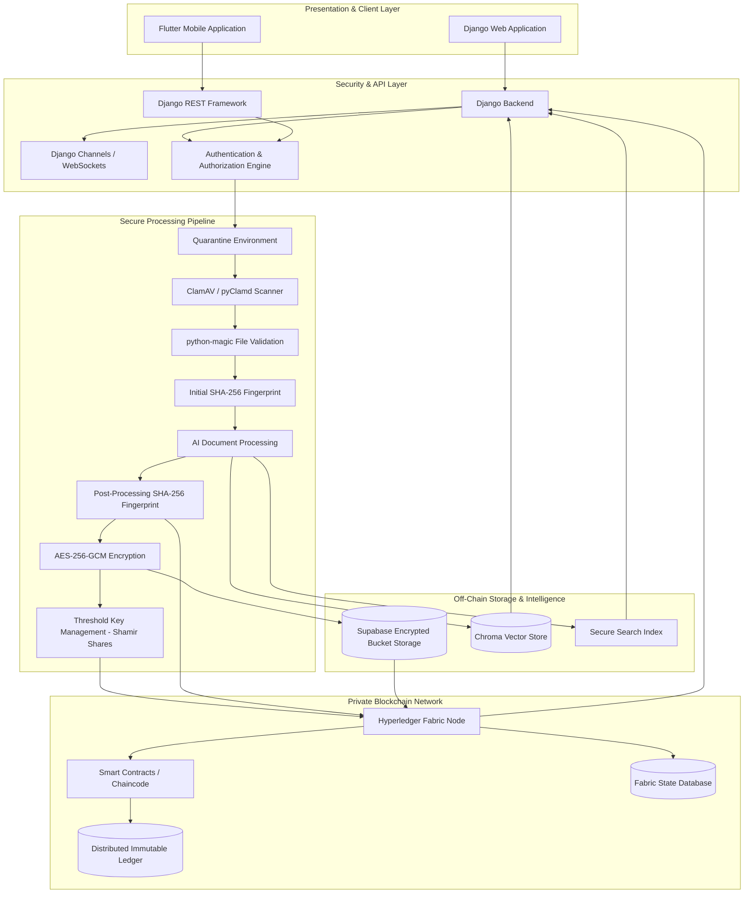
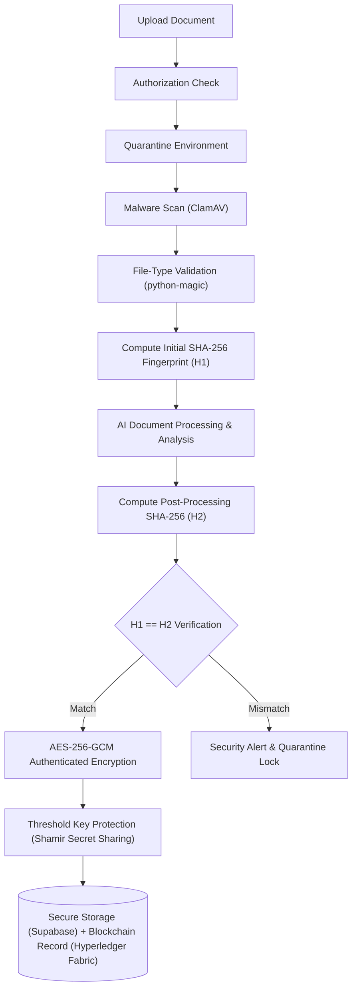
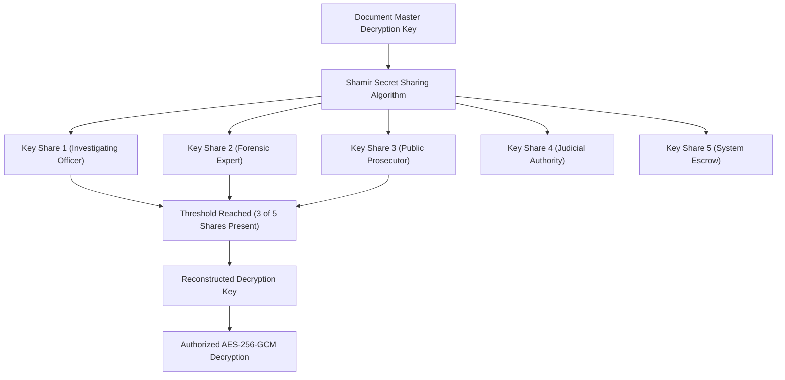
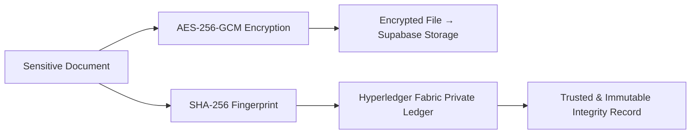
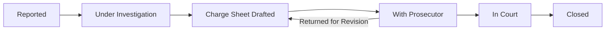
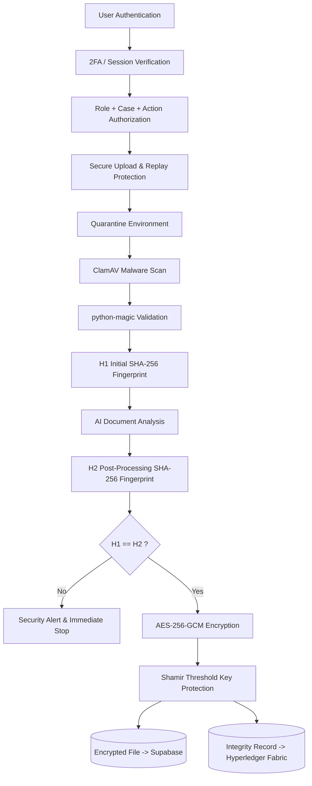
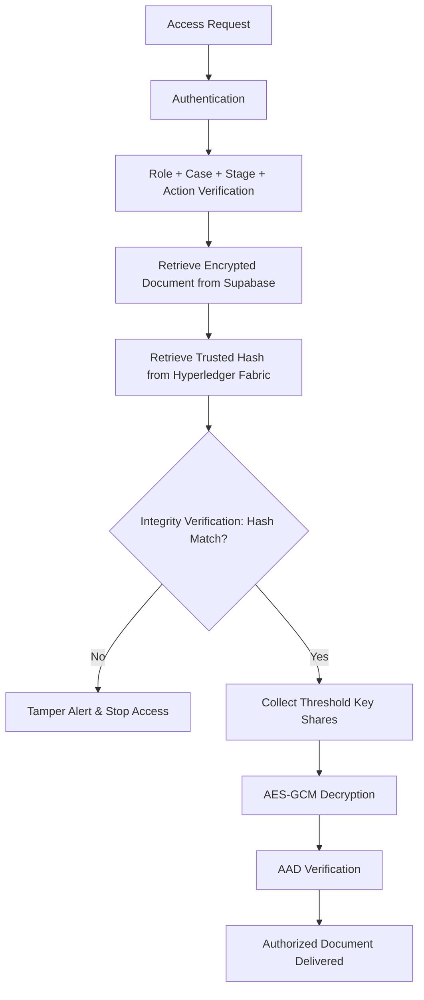
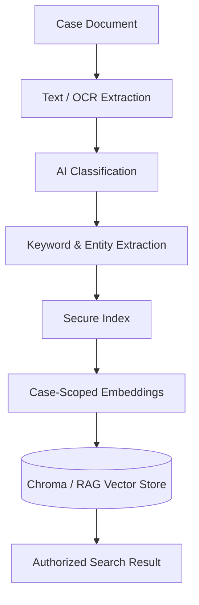
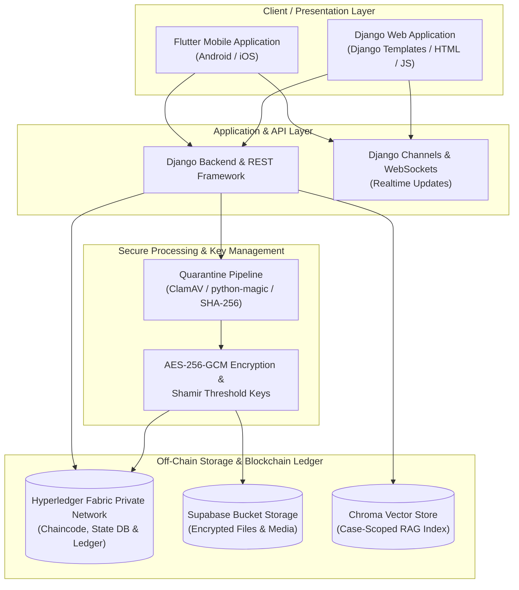
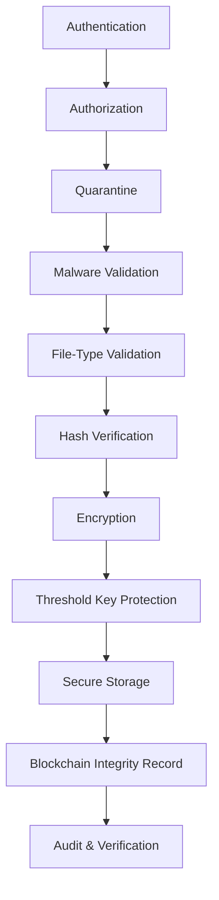

# Pramaan Rakshak: Secure Digital Document & Evidence Management System (SDMS)

### SIH 2026 — Secure Digital Justice & Evidence Management Platform

[](#)
[](https://python.org)
[](https://djangoproject.com)
[](https://flutter.dev)
[](https://www.hyperledger.org/projects/fabric)
[](#)
[](https://supabase.com)

Pramaan Rakshak is a secure digital case, document and evidence management platform designed for **law enforcement, forensic departments, prosecution and judicial workflows**.

The system connects important records throughout the case lifecycle while providing **role-based access, case-level authorization, document encryption, integrity verification, threshold-based key management, tamper-evident history and AI-assisted case intelligence**.

Instead of treating sensitive case records as ordinary files, Pramaan Rakshak creates a **trusted and traceable digital journey** for every case.

> **One Case. One Trusted Record. One Traceable Journey.**

---

## 🏛️ Executive Summary

A single criminal case can generate FIRs, witness statements, evidence records, forensic reports, investigation documents, charge sheets, prosecution records and court documents.

These records may pass through multiple stakeholders and stages.

Pramaan Rakshak provides a common secure environment where authorized users can:

* Create and manage cases
* Upload and verify sensitive documents
* Track evidence and document movement
* Control access according to role, case, stage and action
* Verify document integrity
* Protect documents using strong encryption
* Perform secure keyword and semantic searches
* Use AI-assisted document analysis
* Maintain a verifiable history of critical actions
* Receive real-time case updates

The platform uses a **private Hyperledger Fabric network** as the trusted ledger layer while keeping large encrypted documents off-chain.

---

# 🎯 Core Objectives

1. **Protect Sensitive Case Records**
   * Encrypt documents and restrict access to authorized users.

2. **Maintain Document Integrity**
   * Use SHA-256 fingerprints and blockchain-anchored verification.

3. **Track the Evidence Journey**
   * Maintain a traceable history of important document and evidence events.

4. **Prevent Unauthorized Access**
   * Combine RBAC with case assignment, case stage and action permissions.

5. **Accelerate Case Intelligence**
   * Use AI-assisted classification, extraction, summarization and secure search.

---

# ⚙️ System Architecture



---

# 🧱 Architecture Layers

### 1. Client Layer

**Web Application**
* Django Templates
* HTML
* CSS
* JavaScript

**Mobile Application**
* Flutter
* Dart
* Android

The web and mobile applications use the same backend services and authorization model.

---

### 2. Application Layer

**Backend**
* Django
* Django REST Framework
* Python

**Realtime Communication**
* Django Channels
* WebSockets
* Live Case Updates

The backend handles business logic, authentication, authorization, case workflows and communication with the blockchain and storage layers.

---

### 3. Security Processing Layer

Every uploaded document passes through controlled processing before becoming an active case record.



---

# 🔐 Document Security

## Quarantine & Validation

Uploaded files are not immediately trusted.

They first enter a temporary processing environment where:
* **ClamAV / pyClamd** checks for malicious content
* **python-magic** validates the actual file type
* **SHA-256** creates an initial document fingerprint
* **AI processing** is performed under controlled conditions
* **A second SHA-256 fingerprint** verifies processing integrity

Only validated documents proceed to active storage.

---

# 🔒 AES-256-GCM Encryption

Validated documents are encrypted using **AES-256-GCM**.

Authenticated Additional Data (AAD) binds the encrypted document to:
* Case ID
* Document ID
* Document version
* Document type

This ensures that an encrypted document cannot be detached or fraudulently reassigned to another case context without detection.

---

# 🔑 Threshold Key Management

Pramaan Rakshak uses **Shamir Secret Sharing** for sensitive decryption-key protection.

Instead of depending on one complete key held by a single party, the master key is divided into multiple cryptographic shares.



This eliminates single points of compromise and enforces multi-stakeholder consensus for sensitive evidence decryption.

---

# ⛓️ Hyperledger Fabric

Pramaan Rakshak uses a **private Hyperledger Fabric network** as its trusted distributed ledger.

The blockchain is used for records such as:
* Document fingerprints
* Case lifecycle events
* Upload events
* Approval events
* Rejection events
* Evidence movement
* Critical actions
* Integrity verification records
* Required key-management references

Large documents and sensitive document contents are **not stored directly on the blockchain**.

Fabric's private-data capabilities can also restrict selected ledger data to authorized organizations.

### Blockchain Principle



---

# 📦 Storage Architecture

Pramaan Rakshak does **not use PostgreSQL as a separate application database**.

### Encrypted Document Storage
**Supabase Bucket Storage**
Used for:
* Encrypted documents
* Evidence files
* Images
* Videos
* Other protected media

### Trusted Case & Integrity Records
**Hyperledger Fabric**
Used for:
* Case references
* Document references
* Hashes
* Lifecycle events
* Critical transaction history
* Integrity verification records
* Blockchain-backed audit information

### AI / Semantic Search
**Chroma**
Used for:
* Vector embeddings
* Semantic retrieval
* Case-scoped document search

### Fabric Internal State
Hyperledger Fabric peers maintain their own ledger state using Fabric-supported state databases such as LevelDB or CouchDB; this is part of the Fabric infrastructure rather than a separate PostgreSQL application database.

---

# 👥 Role-Based & Case-Based Access Control

Pramaan Rakshak uses more than simple role-based access.

Authorization is determined by:

$$\text{Authorization} = \text{ROLE} + \text{CASE ASSIGNMENT} + \text{CASE STAGE} + \text{ACTION PERMISSION}$$

A user having a valid login does not automatically provide access to every case or every document.

---

## 👮 Supported Roles

| Role | Primary Responsibility |
| :--- | :--- |
| **ADMIN** | User, role, system and access administration |
| **CONSTABLE** | Assigned field-level case activities and permitted evidence/document operations |
| **HEAD CONSTABLE** | Supervisory police activities according to assignment and permissions |
| **DUTY OFFICER** | FIR/initial case registration and duty-related case operations |
| **INVESTIGATING OFFICER** | Investigation, evidence and investigation-document management |
| **FORENSIC EXPERT** | Forensic evidence and forensic report management |
| **DSP / ACP** | Supervisory review and approval activities |
| **SP / DCP** | Senior-level investigation and case supervision |
| **PUBLIC PROSECUTOR** | Prosecution review and charge-sheet related workflow |
| **JUDGE** | Authorized judicial review and court-stage case records |

Permissions remain subject to the current case stage and assigned responsibilities.

---

# 🔄 Case Lifecycle



Each transition can be subjected to:
* Role verification
* Case authorization
* Stage validation
* Action permission
* Step-up authentication
* Digital signature where required
* Audit recording
* Blockchain anchoring

---

# 📄 Secure Document Upload



---

# 🔍 Secure Document Retrieval



---

# 🤖 AI-Assisted Case Intelligence

Pramaan Rakshak uses AI as an **assistance layer**, not as the authority for legal decisions.

AI capabilities include:
* Document classification
* Keyword extraction
* Entity extraction
* PII detection
* Document summarization
* Case-scoped semantic search
* Relevant-document retrieval
* RAG-based case assistance

### Processing Model



AI retrieval is restricted according to the user's existing case authorization.

---

# 🛡️ Security Controls

### Authentication
* Secure login
* JWT for mobile/API workflows
* Django session authentication for web
* Two-factor authentication
* Session management

### Authorization
* RBAC
* Case assignment
* Case-stage permissions
* Action-level permissions
* Step-up verification

### Cryptography
* AES-256-GCM
* SHA-256
* Shamir Secret Sharing
* Authenticated Additional Data (AAD)
* Digital signatures

### File Security
* Quarantine processing
* ClamAV / pyClamd
* python-magic
* Hash-before / hash-after verification

### Network Security
* TLS 1.3
* Request nonce
* Timestamp validation
* Unique request ID
* Replay protection

### Blockchain Security
* Private Hyperledger Fabric network
* Smart contracts / chaincode
* Endorsement policies
* Cryptographic document fingerprints
* Distributed verification
* Private data controls where required

---

# 🔎 Secure Keyword Search

Pramaan Rakshak provides search across authorized case information.

Search can use:
* Case ID
* Document type
* Extracted keywords
* Entities
* Evidence references
* Case stage
* Semantic similarity

The search layer must enforce the same authorization boundaries as normal document access. A user must not receive search results from a case or document they are not authorized to access.

---

# 📋 Audit & Accountability

Important activities generate traceable records, including:
* Login and authentication events
* Document uploads
* Document verification
* Approvals
* Rejections
* Evidence movement
* Case-stage changes
* Critical document access
* Decryption events
* User and role changes
* Other protected actions

The audit history can be cryptographically linked and anchored to the private blockchain for later verification.

---

# ⚡ Real-Time Case Updates

Django Channels and WebSockets provide real-time updates for authorized users.

Examples:
* New document uploaded
* Evidence movement
* Approval status changed
* Document rejected
* Case-stage transition
* Critical case activity
* Security alerts

Users receive only updates belonging to cases and activities they are authorized to observe.

---

# 🧩 Technology Stack

### Web
* Django Templates
* HTML
* CSS
* JavaScript

### Mobile
* Flutter
* Dart

### Backend
* Django
* Django REST Framework
* Python

### Blockchain
* Hyperledger Fabric
* Chaincode / Smart Contracts
* Private Blockchain Network

### Storage
* Supabase Bucket Storage

### AI & Search
* Python
* LLM
* Chroma
* RAG
* Secure Keyword Index

### Security
* AES-256-GCM
* SHA-256
* Shamir Secret Sharing
* RBAC
* JWT
* 2FA
* WebAuthn / Step-Up Verification
* TLS 1.3
* Digital Signatures
* ClamAV
* python-magic

### Realtime
* Django Channels
* WebSockets
* Live Case Updates

---

# 🏗️ Deployment Architecture

The system is designed for a private, controlled deployment.



---

# 🚀 Development

## Web Application

The web application is built using Django Templates and communicates with the Django backend directly.

```bash
python -m venv venv

# Windows
venv\Scripts\activate

# Linux/macOS
source venv/bin/activate

pip install -r requirements.txt

python manage.py migrate
python manage.py runserver
```

---

## Flutter Mobile Application

```bash
cd mobile

flutter pub get

flutter run
```

For a production Android build:

```bash
flutter build apk --release
```

---

# 🧪 Testing

The system should be tested across:

### Authentication
* Login
* 2FA
* Session/token validation
* Logout
* Replay protection

### Authorization
* Role permissions
* Case assignment
* Case-stage restrictions
* Action-level restrictions
* IDOR/BOLA protection

### Document Security
* Malware detection
* File-type spoofing
* Hash verification
* Encryption/decryption
* AAD verification
* Threshold-key recovery

### Blockchain
* Transaction submission
* Endorsement validation
* Hash anchoring
* Integrity verification
* Unauthorized transaction rejection

### AI
* Document classification
* Keyword extraction
* Entity extraction
* Search authorization
* Case isolation
* Prompt-injection handling

### Realtime
* WebSocket connection
* Case updates
* Authorization filtering
* Connection recovery

---

# 📌 Key Security Principle

Pramaan Rakshak follows a **defense-in-depth** model.

No single technology is treated as the complete security solution.



---

# 🌐 Project Vision

Pramaan Rakshak aims to create a secure digital foundation for sensitive case records and evidence.

The objective is simple:

> **Connect the case. Protect the evidence. Verify the record. Track every critical action.**

From the first report to investigation, forensic examination, prosecution and court proceedings, Pramaan Rakshak keeps the digital case journey **secure, connected, verifiable and intelligent**.

---

## 📄 License

Developed for **Smart India Hackathon 2026**.

**Pramaan Rakshak — One Case. One Trusted Record. One Traceable Journey.**
