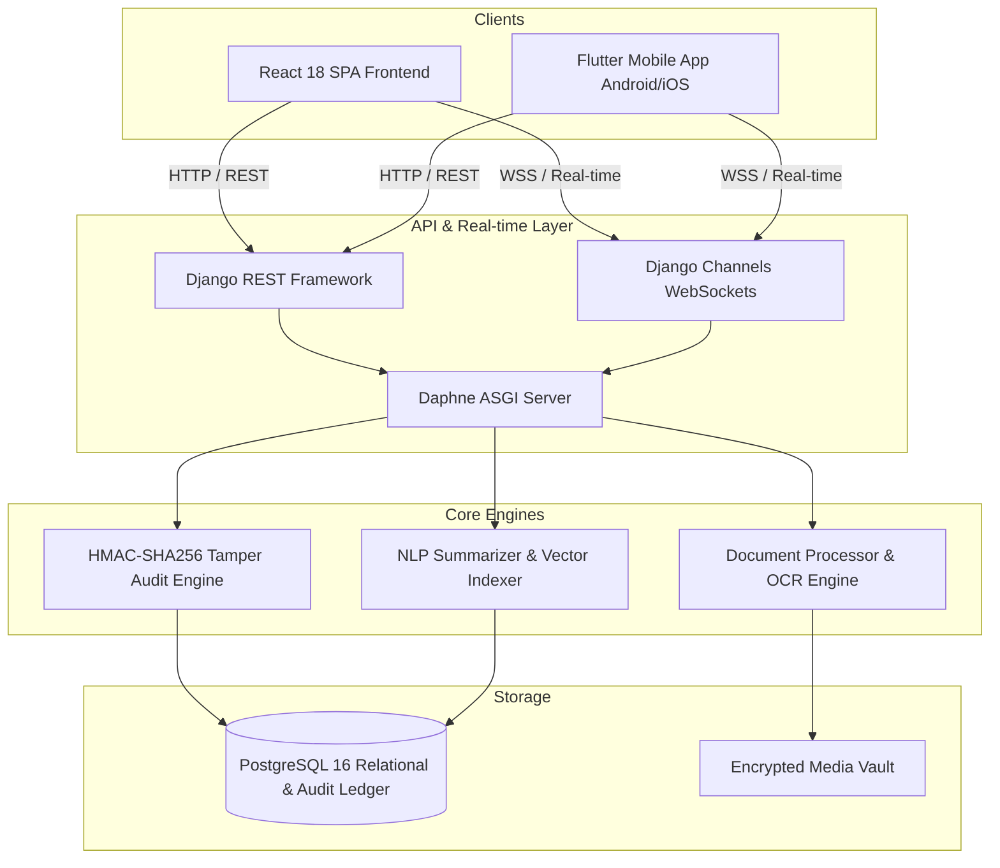

# Praman Rakshak: Smart Digital Evidence Management System (SDMS)
### SIH 2024 / SIH 2026 - National Digital Forensic and Law Enforcement Initiative

[](#)
[](https://python.org)
[](https://djangoproject.com)
[](https://react.dev)
[](https://flutter.dev)
[](https://postgresql.org)
[](#)

---

## 🏛️ Executive Summary

**Praman Rakshak** is an enterprise-grade Smart Digital Evidence Management System (SDMS) tailored for law enforcement agencies, judiciary bodies, and forensic examiners. Built to conform with the Indian Evidence Act and national cyber-forensic protocols, Praman Rakshak enforces cryptographic chain of custody, role-based access control (RBAC), and automated AI-assisted evidence intake.

---

## ⚙️ Core Architecture & Tech Stack



- **Backend**: Django 5.0, Django REST Framework, SimpleJWT, Channels 4.0, Daphne ASGI
- **Frontend**: React 18, Vite, Tailwind CSS, Lucide Icons
- **Mobile**: Flutter 3.x, Dart (Null-Safe), Flutter Secure Storage, Biometric Auth
- **Database**: PostgreSQL 16 with cryptographic audit chain hashing
- **Security**: PBKDF2 user authentication, HMAC-SHA256 chained audit logs, RSA/AES-256 evidence vault encryption

---

## 👥 Role-Based Access Control (RBAC) & Canonical Workflow

The system strictly enforces five distinct administrative and judicial roles:

| Role | Permissions & Canonical Responsibilities |
| :--- | :--- |
| **POLICE** | • Registers criminal cases<br>• Directly uploads initial FIR (auto-verified, no approval required)<br>• Uploads complainant statements & initial evidence (routed for IO review) |
| **ADMIN** | • Complete system administration & user provisioning<br>• System health monitoring & tamper alarm management<br>• **Assigns registered cases to Investigation Officers (IO)** |
| **INVESTIGATOR** | • Conducts case investigations & field collections<br>• Uploads search & seizure memos, witness statements, FSL reports<br>• Reviews pending document submissions<br>• **Prepares and submits Final Case Reports** |
| **LEGAL_OFFICER** | • Conducts legal appraisal of case dockets & evidence validity<br>• Signs legal endorsements and case reviews |
| **JUDGE** | • Reviews courtroom dockets & cryptographic audit certificates<br>• Performs semantic search across verified case records<br>• Issues judicial dispositions |

### Canonical Case Lifecycle Flow:
$$\text{Police Creates Case} \longrightarrow \text{Police Uploads FIR} \longrightarrow \text{Admin Assigns IO} \longrightarrow \text{IO Investigates \& Adds Evidence} \longrightarrow \text{IO Uploads Final Report}$$

---

## 🔒 Cryptographic Audit Chain (Tamper-Evident Ledger)

Every critical action, document upload, status transition, and assignment generates an immutable audit record:

$$\text{Entry Hash} = \text{HMAC-SHA256}\Big(\text{Secret}, \text{PrevHash} \parallel \text{Timestamp} \parallel \text{Action} \parallel \text{EntityID} \parallel \text{PayloadHash}\Big)$$

- If any database record or document is altered out-of-band, the verification algorithm immediately flags the broken block index.
- A live tamper demonstration script is available at `demo_tamper.py` and `demo_restore.py`.

---

## 🚀 Quick Start Guide (Local Development)

### Prerequisites
- Python 3.11+
- Node.js 18+ & npm
- PostgreSQL 14+ running locally (default DB: `sdms_db`)
- Flutter SDK (for mobile app)

### 1. Backend Setup
```bash
cd backend
python -m venv venv
venv\Scripts\activate   # Linux/macOS: source venv/bin/activate
pip install -r requirements.txt
cp .env.example .env     # Update your database credentials if required
python manage.py migrate
python manage.py collectstatic --noinput
python manage.py runserver 0.0.0.0:8000
```

### 2. Frontend Setup (React Dev Server)
```bash
cd backend/frontend
npm install
npm run dev
```
The React development server runs at `http://localhost:5173` with automatic API and WebSocket proxy to `http://localhost:8000`.

### 3. Flutter Mobile Setup
```bash
cd mobile
flutter pub get
flutter run
```

---

## 🌐 Production Deployment

### Option A: 1-Click Cloud Deployment with Render Blueprint
1. Push this repository to GitHub.
2. Go to **[Render Dashboard](https://dashboard.render.com/)** $\rightarrow$ **Blueprints** $\rightarrow$ **New Blueprint Instance**.
3. Select your repository. Render automatically provisions:
   - PostgreSQL 16 database (`sdms_db`)
   - Web service running Daphne ASGI with React frontend, REST API, and WebSockets.

### Option B: Docker Compose
```bash
docker-compose up --build -d
```
Spins up PostgreSQL, Redis, and Daphne ASGI containers with all database migrations applied automatically.

---

## 📱 Mobile Production APK Build

To compile a release Android APK pointing to your production server:
```bash
cd mobile
flutter build apk --release --dart-define=SERVER_HOST=your-production-domain.com
```
The signed APK will be output at `mobile/build/app/outputs/flutter-apk/app-release.apk`.

---

## 🧪 Testing and Verification Suite

```bash
# Run all Django backend unit and integration tests (20/20 passed)
cd backend
python manage.py test tests

# Run End-to-End Canonical Workflow test
python ../scratch/test_canonical_workflow.py

# Flutter static analysis (0 errors, 0 warnings)
cd ../mobile
flutter analyze
```

---

## 📄 License
This project is licensed under the Apache 2.0 License. Developed for Smart India Hackathon (SIH).
